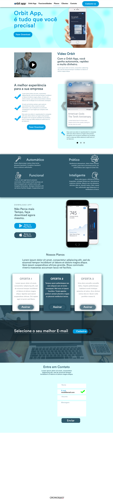

# Projeto Orbit
Instala todas as fontes da pasta Fontes, o arquivo principal é o <b>Orbit APP.psd</b> ou  o arquivo <b>Orbit APP.zip</b>, requer o Photoshop instalado.
<h2>Desktop</h2>

  
<h2>Mobile</h2>

